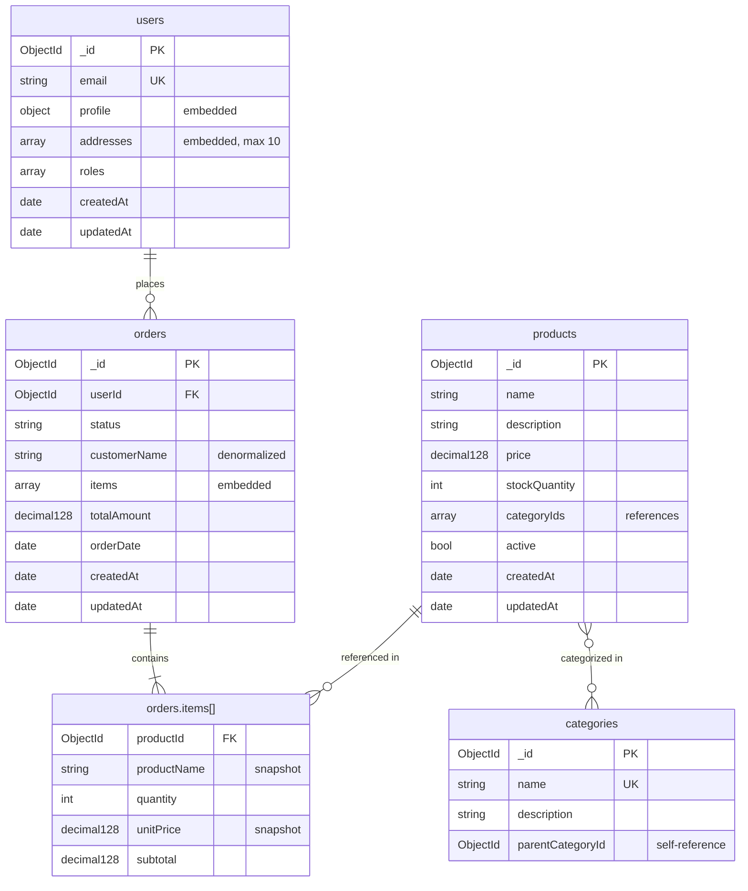

# NoSQL Schema Builder

Design and document NoSQL database schemas — primarily MongoDB — applying industry best practices for document modeling, indexing, validation, and data architecture.

## Workflow

1. **Gather context** — Understand the domain, entities, query patterns, and target database engine
2. **Select schema profile** — Choose depth based on project needs
3. **Analyze and model collections** — Identify documents, fields, relationships, and embedding/referencing decisions
4. **Apply modeling principles and best practices** — Validate the design against NoSQL-specific rules and patterns
5. **Generate outputs** — Produce collection diagrams, JSON Schema validations, and documentation
6. **Deploy to MongoDB (optional)** — Create collections, indexes, and validations via MCP on user request

## Step 1: Gather Context

Before designing, collect essential information. If the user provides a codebase, analyze domain classes, repositories, and existing schemas to pre-fill as much as possible.

### Essential Information

| Information | Why It Matters | How to Get It |
|-------------|---------------|---------------|
| **Domain / project name** | Frames naming conventions and context | Ask or infer from codebase |
| **Database engine** | Determines features and syntax | MongoDB, DynamoDB, Cassandra, Redis, Neo4j |
| **Entities / business objects** | Core of the data model | Ask, analyze domain classes, or infer from requirements |
| **Access patterns / queries** | **The #1 driver of NoSQL design** — model for how data is read, not how it's structured | Ask the user or infer from use cases |
| **Relationships between entities** | Determines embedding vs referencing | Ask or infer from code/requirements |
| **Expected data volume and growth** | Influences sharding, TTL, and document size decisions | Ask the user |
| **Read/write ratio** | Embedding favors reads; referencing favors writes | Ask the user |
| **Consistency requirements** | Strong vs eventual consistency needs per collection | Ask the user |
| **Existing schema (if migrating)** | Baseline to evolve from | Read existing collections or migration files |

If the user provides a general description, work with what they give and ask only for critical missing pieces. Default to **MongoDB** if no engine is specified.

### The Fundamental NoSQL Principle

> **Design for your queries, not for your entities.**

Unlike relational databases where you normalize first and optimize later, in NoSQL you start with the access patterns and work backwards to the data model. Every modeling decision (embed vs reference, denormalize, shard key choice) should be justified by a specific query pattern.

## Step 2: Select Schema Profile

| Profile | When to Use | Outputs |
|---------|-------------|---------|
| **Quick** | Early exploration, prototyping | Collection diagram + brief collection descriptions |
| **Standard** | Most projects | Collection diagram + full documentation + JSON Schema validations + index definitions |
| **Comprehensive** | Production systems, high-scale environments | All Standard outputs + sharding strategy + capacity planning + migration guide + data lifecycle policies |

Default to **Standard**. Suggest Quick for prototypes and Comprehensive for production-critical or high-scale systems.

## Step 3: Analyze and Model Collections

### The Embedding vs Referencing Decision

This is the most critical decision in document database design. Use this decision matrix for every relationship:

| Factor | Embed | Reference |
|--------|-------|-----------|
| **Data is read together** | Yes — embed for single-query reads | No — reference to avoid fetching unneeded data |
| **Data has different lifecycles** | No — changes to embedded docs require parent update | Yes — each document updates independently |
| **Cardinality is 1:1 or 1:few** | Yes — natural fit for embedding | Depends on document size |
| **Cardinality is 1:many (bounded)** | Yes — if the array stays small (< ~100 items) | Yes — if the array could grow large |
| **Cardinality is 1:millions or M:N** | No — array would be unbounded | Yes — always reference |
| **Data is shared across documents** | No — duplication leads to inconsistency | Yes — single source of truth |
| **Atomic updates needed** | Yes — MongoDB guarantees single-document atomicity | Multi-document transactions needed |
| **Document size approaching 16MB** | No — split into references | Doesn't apply |

**Rules of thumb:**
- **Embed** what you read together and what doesn't change independently
- **Reference** what grows unbounded, what is shared, and what has its own lifecycle
- A document should represent a **unit of work** — the data you need for one operation
- If in doubt, start with embedding and refactor to referencing when you hit pain points

### Collection Definition

For each collection, define:

| Field | Description |
|-------|-------------|
| **Name** | Plural, camelCase or snake_case (be consistent) — e.g., `orders`, `userProfiles` |
| **Description** | What this collection represents in the domain |
| **Primary key** | `_id` strategy: ObjectId (default), UUID, or natural key |
| **Document structure** | Fields, types, nested objects, arrays |
| **Indexes** | Fields indexed, type (single, compound, multikey, text, TTL, etc.) |
| **Validation** | JSON Schema validation rules |

### Document Structure Table

For each collection, produce a structure table:

| Field | Type | Required | Default | Description | Constraints |
|-------|------|----------|---------|-------------|-------------|
| `_id` | `ObjectId` | YES | auto | Primary key | Unique |
| `email` | `string` | YES | — | User email | Unique index |
| `profile` | `object` | YES | — | Embedded profile info | — |
| `profile.firstName` | `string` | YES | — | First name | minLength: 1 |
| `profile.lastName` | `string` | YES | — | Last name | minLength: 1 |
| `roles` | `array<string>` | YES | `["user"]` | User roles | enum: user, admin, moderator |
| `addresses` | `array<object>` | NO | `[]` | Shipping addresses (max 10) | maxItems: 10 |
| `addresses[].street` | `string` | YES | — | Street address | — |
| `addresses[].city` | `string` | YES | — | City | — |
| `addresses[].zipCode` | `string` | YES | — | Postal code | — |
| `createdAt` | `date` | YES | `$$NOW` | Record creation timestamp | — |
| `updatedAt` | `date` | YES | `$$NOW` | Last modification timestamp | — |

### Relationship Mapping

Document every relationship and its modeling strategy:

| Parent | Related | Cardinality | Strategy | Justification |
|--------|---------|-------------|----------|---------------|
| `user` | `profile` | 1:1 | Embed in user | Always read together, same lifecycle |
| `user` | `addresses` | 1:few | Embed array in user | Bounded (max 10), read with user |
| `order` | `orderItems` | 1:many (bounded) | Embed array in order | Always read together, max ~50 items per order |
| `user` | `orders` | 1:many (unbounded) | Reference (userId in orders) | Grows over time, queried independently |
| `product` | `categories` | M:N | Reference (categoryIds array in product) | Shared data, categories have own lifecycle |
| `post` | `comments` | 1:many (unbounded) | Reference (postId in comments) | Could be thousands, paginated independently |

### Denormalization Strategy

In NoSQL, controlled denormalization is a design tool, not an anti-pattern. Document each instance:

| Collection | Denormalized Field | Source | Reason | Sync Strategy |
|------------|-------------------|--------|--------|---------------|
| `orders` | `customerName` | `users.profile.firstName + lastName` | Display in order list without JOIN | Update on user profile change (Change Streams / application) |
| `orderItems` | `productName`, `productPrice` | `products` | Historical snapshot at time of purchase | Intentional — never synced (price at purchase time) |

**Rules for safe denormalization:**
1. **Document it** — every denormalized field must have a documented source and sync strategy
2. **Distinguish snapshots from caches** — a price at purchase time is a snapshot (never update); a customer name is a cache (sync on change)
3. **Keep the source of truth clear** — one collection owns each piece of data
4. **Automate sync** — use Change Streams, triggers, or application events to keep caches up to date

## Step 4: Apply Modeling Principles and Best Practices

Before generating outputs, validate the design against these rules.

### Document Design Checklist

Apply these rules to every schema. If a rule is intentionally violated, document why.

- [ ] **Design driven by access patterns** — Every collection and embedding decision is justified by a specific query
- [ ] **Document size under control** — No document risks approaching 16MB. Unbounded arrays are referenced, not embedded
- [ ] **_id strategy decided** — ObjectId (default), UUID (distributed systems), or natural key (when appropriate) per collection
- [ ] **Naming conventions consistent** — camelCase or snake_case for fields, plural collection names, consistent across all collections
- [ ] **Required fields marked** — Fields are required unless there's a clear reason to allow absence
- [ ] **Appropriate types** — Use `date` not `string` for timestamps, `decimal128` not `double` for money, `int` not `string` for counts
- [ ] **Audit fields present** — `createdAt` and `updatedAt` on every collection (or a separate audit log)
- [ ] **Indexes cover queries** — Every frequent query pattern has a supporting index
- [ ] **No unnecessary indexes** — Each index has a documented justification (indexes cost write performance and storage)
- [ ] **Soft delete strategy** — Decide: physical delete, soft delete (`deletedAt`), or TTL index. Be consistent
- [ ] **Validation schemas defined** — JSON Schema validation for critical collections to enforce structure at the database level
- [ ] **Array growth bounded** — Embedded arrays have documented maximum sizes; arrays that could grow unbounded use referencing

### Anti-Patterns Checklist

Flag these if found in the design:

| Anti-Pattern | Problem | Fix |
|-------------|---------|-----|
| **Unbounded arrays** | Document grows without limit, hits 16MB, array operations slow down | Reference with a separate collection |
| **Massive documents** | Slow reads (full document loaded), network overhead, working set pressure | Split into smaller documents, reference |
| **Unnecessary normalization** | Multiple queries to assemble data that's always read together | Embed what you read together |
| **Over-embedding** | Embedded data changes independently, causing unnecessary rewrites | Reference data with its own lifecycle |
| **No indexes** | Full collection scans on every query | Index fields used in queries |
| **Too many indexes** | Write amplification, storage waste | Only index fields used in frequent queries |
| **Using $lookup everywhere** | Defeats the purpose of a document database; poor performance at scale | Redesign model to embed or denormalize |
| **String dates** | Cannot query ranges, sort, or use date operators | Use native `Date` type |
| **Floating-point money** | Precision errors in financial calculations | Use `Decimal128` or integer cents |
| **God document** | One collection with deeply nested, overloaded documents covering multiple concerns | Decompose into focused collections |

Load [references/modeling-patterns.md](references/modeling-patterns.md) for detailed document modeling patterns and examples.
Load [references/mongodb-best-practices.md](references/mongodb-best-practices.md) for MongoDB-specific indexing, validation, sharding, and operational best practices.

## Step 5: Generate Outputs

### 5.1 Collection Diagram (Mermaid)

Generate a diagram showing collections, their key fields, and relationships. Use Mermaid `erDiagram` syntax adapted for document databases:



**Conventions for the diagram:**
- Mark embedded objects/arrays with `"embedded"` annotation
- Mark denormalized fields with `"denormalized"` or `"snapshot"` annotation
- Mark reference arrays with `"references"` annotation
- Use `FK` for reference fields, `UK` for unique fields, `PK` for `_id`

### 5.2 JSON Schema Validations

Generate MongoDB JSON Schema validation for each collection:

```javascript
db.createCollection("users", {
  validator: {
    $jsonSchema: {
      bsonType: "object",
      title: "User",
      description: "Application user with profile and addresses",
      required: ["email", "profile", "roles", "createdAt", "updatedAt"],
      properties: {
        _id: { bsonType: "objectId" },
        email: {
          bsonType: "string",
          pattern: "^[a-zA-Z0-9._%+-]+@[a-zA-Z0-9.-]+\\.[a-zA-Z]{2,}$",
          description: "User email address — must be unique"
        },
        profile: {
          bsonType: "object",
          required: ["firstName", "lastName"],
          properties: {
            firstName: { bsonType: "string", minLength: 1, maxLength: 100 },
            lastName: { bsonType: "string", minLength: 1, maxLength: 100 },
            avatarUrl: { bsonType: "string" }
          },
          additionalProperties: false
        },
        roles: {
          bsonType: "array",
          items: { bsonType: "string", enum: ["user", "admin", "moderator"] },
          minItems: 1,
          uniqueItems: true
        },
        addresses: {
          bsonType: "array",
          maxItems: 10,
          items: {
            bsonType: "object",
            required: ["street", "city", "zipCode"],
            properties: {
              street: { bsonType: "string" },
              city: { bsonType: "string" },
              zipCode: { bsonType: "string" },
              country: { bsonType: "string" }
            },
            additionalProperties: false
          }
        },
        createdAt: { bsonType: "date" },
        updatedAt: { bsonType: "date" }
      },
      additionalProperties: false
    }
  },
  validationLevel: "strict",
  validationAction: "error"
});
```

**Validation guidelines:**
- Use `validationLevel: "strict"` for new collections; `"moderate"` when migrating existing data gradually
- Use `validationAction: "error"` for critical fields; `"warn"` during migration periods
- Always set `additionalProperties: false` on the root and on embedded objects to prevent schema drift
- Use `bsonType` (not `type`) for MongoDB-specific types like `objectId`, `date`, `decimal128`

### 5.3 Index Definitions

Generate index creation commands with rationale:

```javascript
// ==================== users ====================
db.users.createIndex({ email: 1 }, { unique: true, name: "idx_users_email_unique" });
// Rationale: unique constraint + login/lookup by email

db.users.createIndex({ "profile.lastName": 1, "profile.firstName": 1 }, { name: "idx_users_name" });
// Rationale: user search by name

db.users.createIndex({ createdAt: 1 }, { name: "idx_users_created" });
// Rationale: sort users by registration date

// ==================== orders ====================
db.orders.createIndex({ userId: 1, orderDate: -1 }, { name: "idx_orders_user_date" });
// Rationale: list orders for a user, most recent first (primary access pattern)

db.orders.createIndex({ status: 1, orderDate: -1 }, { name: "idx_orders_status_date" });
// Rationale: filter orders by status (admin dashboard)

// ==================== products ====================
db.products.createIndex({ name: "text", description: "text" }, { name: "idx_products_text_search" });
// Rationale: full-text search on product catalog

db.products.createIndex({ categoryIds: 1 }, { name: "idx_products_categories" });
// Rationale: multikey index — find products by category

db.products.createIndex({ active: 1, price: 1 }, { name: "idx_products_active_price" });
// Rationale: filter active products sorted by price
```

**Index strategy rules:**
- **Cover your queries** — design indexes that match the query shape (equality → sort → range)
- **Compound index field order matters** — put equality fields first, then sort fields, then range fields (ESR rule)
- **Multikey indexes** — automatically created for array fields; only one array field per compound index
- **Text indexes** — at most one text index per collection; consider Atlas Search for advanced full-text
- **TTL indexes** — use for data with a natural expiry (sessions, logs, temporary tokens)
- **Partial indexes** — index only documents matching a filter to reduce index size
- **Avoid over-indexing** — each index costs write performance and RAM; justify every index with a query

### 5.4 Data Dictionary (Standard and Comprehensive profiles)

For each collection, produce a complete data dictionary:

```markdown
### Collection: `orders`

**Description:** Customer purchase orders with embedded line items.

**Document size estimate:** ~2-5 KB per order (assuming ~10 items average).

| # | Field | Type | Required | Default | Description | Constraints |
|---|-------|------|----------|---------|-------------|-------------|
| 1 | `_id` | ObjectId | YES | auto | Primary key | Unique |
| 2 | `userId` | ObjectId | YES | — | Reference to users collection | Index |
| 3 | `status` | string | YES | "pending" | Order lifecycle status | enum: pending, confirmed, shipped, delivered, cancelled |
| 4 | `customerName` | string | YES | — | Denormalized from users.profile | Sync on user profile change |
| 5 | `items` | array\<object\> | YES | — | Embedded order line items | minItems: 1 |
| 5.1 | `items[].productId` | ObjectId | YES | — | Reference to products | — |
| 5.2 | `items[].productName` | string | YES | — | Snapshot from products.name | Never synced (historical) |
| 5.3 | `items[].quantity` | int | YES | — | Quantity ordered | minimum: 1 |
| 5.4 | `items[].unitPrice` | Decimal128 | YES | — | Price snapshot at purchase time | minimum: 0 |
| 5.5 | `items[].subtotal` | Decimal128 | YES | — | quantity * unitPrice | minimum: 0 |
| 6 | `totalAmount` | Decimal128 | YES | — | Order total | minimum: 0 |
| 7 | `orderDate` | date | YES | $$NOW | When the order was placed | — |
| 8 | `createdAt` | date | YES | $$NOW | Record creation | — |
| 9 | `updatedAt` | date | YES | $$NOW | Last modification | — |

**Indexes:** idx_orders_user_date (userId + orderDate), idx_orders_status_date (status + orderDate)
**References:** users (via userId), products (via items[].productId)
**Denormalized fields:** customerName (from users), items[].productName and items[].unitPrice (snapshots)
```

### 5.5 Sharding Strategy (Comprehensive profile)

For high-scale systems, document the sharding approach:

| Collection | Shard Key | Type | Rationale |
|-----------|-----------|------|-----------|
| `orders` | `{ userId: "hashed" }` | Hashed | Even distribution, queries by userId target single shard |
| `products` | `{ categoryIds: 1, _id: 1 }` | Ranged | Category-based queries hit fewer shards |
| `logs` | `{ timestamp: 1 }` | Ranged | Time-series data, old shards can be archived |

**Shard key selection rules:**
- High cardinality (many distinct values) — avoids jumbo chunks
- Even distribution — avoids hotspots
- Query isolation — queries include the shard key to target a single shard
- Shard key is immutable after creation — choose carefully
- Avoid monotonically increasing keys (ObjectId, timestamp alone) as shard keys — causes write hotspots on the last shard

### 5.6 Data Lifecycle Policies (Comprehensive profile)

| Collection | Policy | Implementation | Rationale |
|-----------|--------|----------------|-----------|
| `sessions` | Expire after 24 hours | TTL index on `createdAt` | Temporary data |
| `auditLogs` | Archive after 90 days | Change Streams → cold storage | Compliance retention |
| `notifications` | Expire after 30 days | TTL index on `createdAt` | Transient data |
| `orders` | Retain indefinitely | No TTL | Business records |

## Output Location

Write outputs to `docs/database/` by default (or the location the user specifies):

| File | Profile | Content |
|------|---------|---------|
| `docs/database/nosql-diagram-<project>.md` | All | Collection diagram with descriptions |
| `docs/database/nosql-schema-<project>.js` | Standard+ | JSON Schema validations for all collections |
| `docs/database/nosql-indexes-<project>.js` | Standard+ | Index creation commands with rationale |
| `docs/database/nosql-data-dictionary-<project>.md` | Standard+ | Full data dictionary |
| `docs/database/nosql-sharding-<project>.md` | Comprehensive | Sharding strategy and shard key rationale |
| `docs/database/nosql-lifecycle-<project>.md` | Comprehensive | Data lifecycle and retention policies |

## Adapting to NoSQL Engine

While the primary focus is MongoDB, adapt the output when the user targets a different NoSQL engine:

| Feature | MongoDB | DynamoDB | Cassandra | Redis | Neo4j |
|---------|---------|----------|-----------|-------|-------|
| **Model type** | Document | Key-Value / Document | Wide-Column | Key-Value | Graph |
| **Schema enforcement** | JSON Schema validation | Attribute definitions | CQL table definition | None (application) | Node/relationship labels |
| **Primary key** | `_id` (any type) | Partition key + optional sort key | Partition key + clustering columns | Key string | Internal ID + labels |
| **Relationships** | Embed or reference | Denormalize or GSI | Denormalize | Application-level | Native edges |
| **Indexing** | B-tree, text, hashed, TTL, geospatial | GSI, LSI | Secondary indexes (limited) | None | Native graph traversal |
| **Transactions** | Multi-document (4.0+) | TransactWriteItems | Lightweight (Paxos) | MULTI/EXEC | ACID per transaction |
| **Scaling** | Sharding | Automatic partitioning | Ring-based partitioning | Clustering | Sharding (Enterprise) |
| **Query language** | MQL / Aggregation pipeline | PartiQL / API | CQL | Commands | Cypher |

### DynamoDB-Specific Considerations

When the target is DynamoDB:
- Design around **single-table patterns** — use composite keys (PK + SK) to model multiple entity types in one table
- Use **GSIs** (Global Secondary Indexes) for alternative access patterns
- Think in terms of **access patterns first** — list all queries before designing the table
- Use `begins_with()` on sort keys for hierarchical queries

### Cassandra-Specific Considerations

When the target is Cassandra:
- **One table per query pattern** — denormalization is the norm
- Partition key determines data distribution; clustering columns determine sort order within a partition
- Avoid large partitions (> 100MB) — design partition keys for even distribution
- No JOINs, no subqueries — model data pre-joined

## Adapting to Project Type

| Project Type | Emphasis | Considerations |
|-------------|----------|----------------|
| **Microservices** | Database per service, no cross-service references | Document data ownership, use events for cross-service sync |
| **Event Sourcing** | Immutable event collections + projection collections | Append-only event collection, materialized views for reads |
| **CQRS** | Separate read/write models | Write model may be normalized; read model is denormalized |
| **Real-time** | Change Streams, low latency | Optimize for write throughput, use capped collections for logs |
| **IoT / Time Series** | Time-series collections, bucketing | Use MongoDB time-series collections (5.0+), TTL for expiry |
| **Content Management** | Flexible schemas, rich documents | Leverage document model for varied content types |
| **Multi-tenant** | Tenant isolation strategy | Options: tenant field + index (shared), database per tenant (isolated) |

## Step 6: Deploy to MongoDB (Optional — On User Request)

When the MongoDB MCP server is available and the user requests it, you can deploy the designed schema directly to a MongoDB instance. **Never deploy automatically — always wait for explicit user confirmation.**

### When to Offer MongoDB Deployment

After generating the schema validations and index definitions (Steps 5.2-5.3), ask the user:
> "The database model is ready. Would you like me to create these collections, validations, and indexes directly in your MongoDB instance?"

### Deployment Workflow

1. **Connect and verify** — Use the MongoDB MCP tools to verify connectivity and list existing databases. Let the user select or confirm the target database.

2. **Review before executing** — Present a summary of what will be created:
   - Collections and their validation schemas
   - Indexes per collection
   - Any TTL or capped collection configurations

3. **Execute in order**:
   - Create collections with validation schemas (`db.createCollection(...)`)
   - Create indexes (`db.collection.createIndex(...)`)
   - Set up any TTL indexes or capped collections

4. **Verify creation** — After execution, list collections and indexes to confirm they match the design.

5. **Report results** — Show the user what was created successfully and flag any errors.

### What You Can Do via MongoDB MCP

Use the available MongoDB MCP tools to:
- **Create collections** — With JSON Schema validation rules
- **Create and manage indexes** — Single, compound, multikey, text, TTL, unique, partial
- **Run queries** — For verification, data seeding, or checking existing state
- **List databases and collections** — Check current state before making changes
- **Manage documents** — Insert seed data if needed

### Important Rules

- **Always ask before executing** — Never create collections or indexes without explicit user approval
- **Show the commands first** — Let the user review exactly what will be executed
- **Handle errors gracefully** — If a collection already exists, ask the user if they want to drop and recreate, update validation, or skip
- **Keep documentation in sync** — The generated docs (diagram, schema, data dictionary) remain the source of truth; the MongoDB instance is just the deployment target
- **Warn about destructive operations** — Dropping collections, modifying validators on existing data, or removing indexes may cause data loss or downtime

## References

- [references/modeling-patterns.md](references/modeling-patterns.md) — Document modeling patterns: embedding strategies, referencing patterns, polymorphism, tree structures, versioning, and time-series bucketing
- [references/mongodb-best-practices.md](references/mongodb-best-practices.md) — MongoDB-specific best practices: indexing deep dive, schema validation, aggregation pipeline design, sharding, Change Streams, and operational guidelines
