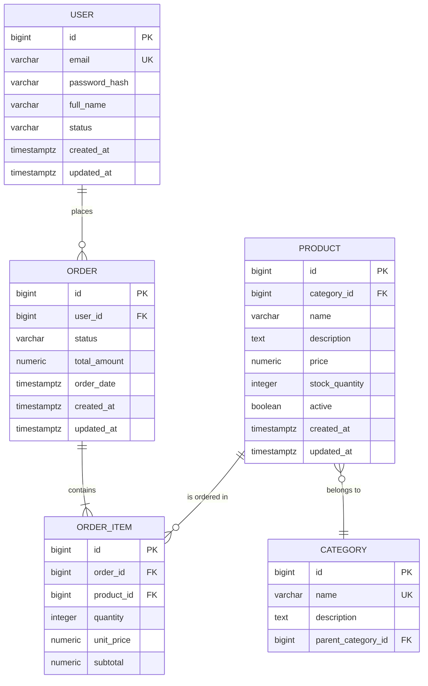

# Relational Database Schema Builder

Generate comprehensive relational database schema documentation, ER diagrams in Mermaid syntax, and DDL scripts applying industry best practices for data modeling.

## Workflow

1. **Gather context** — Understand the domain, entities, and database engine
2. **Select schema profile** — Choose depth based on project needs
3. **Analyze and model entities** — Identify entities, attributes, relationships, and constraints
4. **Apply normalization and best practices** — Validate the design against normalization rules and common patterns
5. **Generate outputs** — Produce ER diagrams, DDL scripts, and documentation

## Step 1: Gather Context

Before designing, collect essential information. If the user provides a codebase, analyze entities, repositories, and existing migrations to pre-fill as much as possible.

### Essential Information

| Information | Why It Matters | How to Get It |
|-------------|---------------|---------------|
| **Domain / project name** | Frames naming conventions and context | Ask or infer from codebase |
| **Database engine** | Determines data types, syntax, and features | PostgreSQL, MySQL, SQL Server, Oracle, SQLite |
| **Entities / business objects** | Core of the data model | Ask, analyze domain classes, or infer from requirements |
| **Relationships between entities** | Defines foreign keys and cardinality | Ask or infer from code/requirements |
| **Known constraints** | Business rules that translate to DB constraints | Ask the user |
| **Expected data volume** | Influences indexing and partitioning decisions | Ask the user |
| **Existing schema (if migrating)** | Baseline to evolve from | Read migration files or DB dump |

If the user provides a general description, work with what they give and ask only for critical missing pieces. Default to **PostgreSQL** if no engine is specified.

## Step 2: Select Schema Profile

| Profile | When to Use | Outputs |
|---------|-------------|---------|
| **Quick** | Early exploration, prototyping | ER diagram + brief table descriptions |
| **Standard** | Most projects | ER diagram + full documentation + DDL script |
| **Comprehensive** | Production systems, regulated environments | All Standard outputs + indexing strategy + migration scripts + data dictionary + audit considerations |

Default to **Standard**. Suggest Quick for prototypes and Comprehensive for production-critical or regulated systems.

## Step 3: Analyze and Model Entities

### Entity Identification

For each entity, define:

| Field | Description |
|-------|-------------|
| **Name** | Singular, snake_case (e.g., `customer_order`) |
| **Description** | What this entity represents in the domain |
| **Primary Key** | Prefer surrogate keys (`id BIGSERIAL` / `UUID`) unless a natural key is clearly better |
| **Attributes** | Column name, data type, nullable, default, description |
| **Constraints** | UNIQUE, CHECK, NOT NULL, business rules |

### Attribute Definition Table

For each entity, produce a table like this:

| Column | Type | Nullable | Default | Description | Constraints |
|--------|------|----------|---------|-------------|-------------|
| `id` | `BIGSERIAL` | NO | auto | Primary key | PK |
| `email` | `VARCHAR(255)` | NO | — | User email address | UNIQUE |
| `status` | `VARCHAR(20)` | NO | `'active'` | Account status | CHECK (status IN ('active','inactive','suspended')) |
| `created_at` | `TIMESTAMPTZ` | NO | `NOW()` | Record creation timestamp | — |
| `updated_at` | `TIMESTAMPTZ` | NO | `NOW()` | Last modification timestamp | — |

### Relationship Mapping

Document every relationship explicitly:

| Parent Entity | Child Entity | Cardinality | FK Column | On Delete | On Update | Description |
|--------------|-------------|-------------|-----------|-----------|-----------|-------------|
| `user` | `order` | 1:N | `order.user_id` | RESTRICT | CASCADE | A user places many orders |
| `order` | `order_item` | 1:N | `order_item.order_id` | CASCADE | CASCADE | An order contains many items |
| `student` | `course` | M:N | `enrollment` (junction) | CASCADE | CASCADE | Students enroll in courses |

**Cardinality rules:**
- **1:1** — FK with UNIQUE constraint on the child side, or merge into one table if lifecycle is identical
- **1:N** — FK on the "many" side referencing the "one" side
- **M:N** — Junction/association table with composite PK or surrogate PK + unique constraint on (fk1, fk2)

### Handling Many-to-Many Relationships

Always create an explicit junction table. If the relationship carries attributes (date, status, quantity), those belong on the junction table.

```sql
-- Simple M:N
CREATE TABLE student_course (
    student_id BIGINT NOT NULL REFERENCES student(id) ON DELETE CASCADE,
    course_id  BIGINT NOT NULL REFERENCES course(id) ON DELETE CASCADE,
    PRIMARY KEY (student_id, course_id)
);

-- M:N with attributes
CREATE TABLE enrollment (
    id            BIGSERIAL PRIMARY KEY,
    student_id    BIGINT NOT NULL REFERENCES student(id) ON DELETE CASCADE,
    course_id     BIGINT NOT NULL REFERENCES course(id) ON DELETE CASCADE,
    enrolled_at   TIMESTAMPTZ NOT NULL DEFAULT NOW(),
    status        VARCHAR(20) NOT NULL DEFAULT 'active',
    grade         DECIMAL(4,2),
    UNIQUE (student_id, course_id)
);
```

## Step 4: Apply Normalization and Best Practices

Before generating outputs, validate the design against normalization rules and best practices.

### Normalization Checklist

| Normal Form | Rule | Check |
|-------------|------|-------|
| **1NF** | Every column holds atomic values, no repeating groups | No arrays, no comma-separated values, no JSON blobs for structured data |
| **2NF** | Every non-key column depends on the *entire* primary key | Only relevant for composite PKs — split if partial dependency exists |
| **3NF** | No non-key column depends on another non-key column | If A → B → C, move B → C to its own table |
| **BCNF** | Every determinant is a candidate key | Check for non-trivial functional dependencies |

**Pragmatic denormalization**: Explain when controlled denormalization is acceptable (read-heavy reporting tables, materialized views, calculated fields cached for performance). Always document the trade-off.

### Design Best Practices Checklist

Apply these rules to every schema. If a rule is intentionally violated, document why.

- [ ] **Naming conventions** — snake_case for tables and columns, singular table names, descriptive names (avoid abbreviations)
- [ ] **Primary keys** — Every table has an explicit PK. Prefer `BIGSERIAL`/`BIGINT` for high-volume, `UUID` for distributed systems
- [ ] **Foreign keys** — Every relationship has an explicit FK constraint with appropriate ON DELETE/ON UPDATE actions
- [ ] **NOT NULL by default** — Columns are NOT NULL unless there's a clear reason to allow nulls
- [ ] **Appropriate data types** — Use the most specific type (`TIMESTAMPTZ` not `VARCHAR` for dates, `NUMERIC(10,2)` not `FLOAT` for money, `BOOLEAN` not `CHAR(1)` for flags)
- [ ] **Audit columns** — `created_at` and `updated_at` on every table (or a separate audit log for regulated systems)
- [ ] **Indexes** — PK (automatic), FK columns, columns used in WHERE/JOIN/ORDER BY, unique constraints
- [ ] **Soft delete strategy** — Decide: physical delete, soft delete (`deleted_at`), or status-based archival. Be consistent across the schema
- [ ] **Enum handling** — Use CHECK constraints, lookup/reference tables, or native ENUM types depending on volatility and engine
- [ ] **Avoid reserved words** — Don't name columns `user`, `order`, `group`, `table` — use `app_user`, `customer_order`, etc., or always quote identifiers

Load [references/normalization-guide.md](references/normalization-guide.md) for detailed normalization examples and anti-patterns.
Load [references/design-patterns.md](references/design-patterns.md) for common database design patterns (polymorphism, hierarchies, temporal data, multi-tenancy).

## Step 5: Generate Outputs

### 5.1 ER Diagram (Mermaid)

Generate an ER diagram using Mermaid `erDiagram` syntax. Follow these conventions:

- Show all entities with their key attributes (PK, FK, important business fields)
- Clearly indicate relationship cardinality
- Group related entities visually when possible



**Mermaid cardinality notation:**
| Symbol | Meaning |
|--------|---------|
| `\|\|` | Exactly one |
| `o\|` | Zero or one |
| `}o` | Zero or many |
| `}\|` | One or many |
| `\|{` | One or many (right side) |
| `o{` | Zero or many (right side) |

### 5.2 DDL Script

Generate a complete, executable DDL script. Structure:

```sql
-- ============================================================
-- Database Schema: <project_name>
-- Engine: <PostgreSQL|MySQL|etc.>
-- Generated: <date>
-- ============================================================

-- ==================== Extensions / Setup ====================
-- (PostgreSQL-specific extensions, character sets, etc.)

-- ==================== Tables ====================
-- Create tables in dependency order (parents before children)

CREATE TABLE category (
    id              BIGSERIAL PRIMARY KEY,
    name            VARCHAR(100) NOT NULL UNIQUE,
    description     TEXT,
    parent_category_id BIGINT REFERENCES category(id) ON DELETE SET NULL,
    created_at      TIMESTAMPTZ NOT NULL DEFAULT NOW(),
    updated_at      TIMESTAMPTZ NOT NULL DEFAULT NOW()
);

-- ... remaining tables in dependency order ...

-- ==================== Indexes ====================
-- Separate section for non-PK, non-unique indexes

CREATE INDEX idx_order_user_id ON customer_order(user_id);
CREATE INDEX idx_order_status ON customer_order(status);
CREATE INDEX idx_order_item_product_id ON order_item(product_id);
CREATE INDEX idx_product_category_id ON product(category_id);

-- ==================== Comments ====================
-- Table and column comments for documentation

COMMENT ON TABLE customer_order IS 'Customer purchase orders';
COMMENT ON COLUMN customer_order.status IS 'Order status: pending, confirmed, shipped, delivered, cancelled';
```

**DDL guidelines:**
- Create tables in dependency order (no forward references)
- Group: tables → indexes → comments → seed data (if any)
- Include `COMMENT ON` statements for tables and non-obvious columns
- For MySQL, specify `ENGINE=InnoDB` and `DEFAULT CHARSET=utf8mb4`
- Adapt data types to the target engine (see type mapping reference in design-patterns)

### 5.3 Data Dictionary (Standard and Comprehensive profiles)

For each table, produce a complete data dictionary:

```markdown
### Table: `customer_order`

**Description:** Stores customer purchase orders.

| # | Column | Type | Nullable | Default | Description | Constraints |
|---|--------|------|----------|---------|-------------|-------------|
| 1 | `id` | BIGSERIAL | NO | auto | Primary key | PK |
| 2 | `user_id` | BIGINT | NO | — | Customer who placed the order | FK → user(id) |
| 3 | `status` | VARCHAR(20) | NO | 'pending' | Order lifecycle status | CHECK IN ('pending','confirmed','shipped','delivered','cancelled') |
| 4 | `total_amount` | NUMERIC(12,2) | NO | 0.00 | Order total including tax | CHECK (total_amount >= 0) |
| 5 | `order_date` | TIMESTAMPTZ | NO | NOW() | When the order was placed | — |
| 6 | `created_at` | TIMESTAMPTZ | NO | NOW() | Record creation | — |
| 7 | `updated_at` | TIMESTAMPTZ | NO | NOW() | Last modification | — |

**Indexes:** idx_order_user_id (user_id), idx_order_status (status)
**Relationships:** user (1:N), order_item (1:N)
```

### 5.4 Indexing Strategy (Comprehensive profile)

Document the indexing rationale:

| Index Name | Table | Columns | Type | Rationale |
|-----------|-------|---------|------|-----------|
| `idx_order_user_id` | `customer_order` | `user_id` | B-Tree | FK lookup, frequent JOIN with user table |
| `idx_order_status` | `customer_order` | `status` | B-Tree | Filtered queries by order status |
| `idx_product_name_search` | `product` | `name` | GIN (trigram) | Text search on product names |

**When to add indexes:**
- FK columns (always — not auto-created in PostgreSQL)
- Columns in WHERE clauses with high selectivity
- Columns in ORDER BY / GROUP BY
- Composite indexes for multi-column queries (put the most selective column first)

**When NOT to add indexes:**
- Small tables (< 1000 rows) — sequential scan is faster
- Columns with low cardinality (boolean flags) unless combined in a composite index
- Write-heavy tables where index maintenance cost exceeds query benefit

## Output Location

Write outputs to `docs/database/` by default (or the location the user specifies):

| File | Profile | Content |
|------|---------|---------|
| `docs/database/er-diagram-<project>.md` | All | ER diagram with entity descriptions |
| `docs/database/ddl-<project>.sql` | Standard+ | Complete DDL script |
| `docs/database/data-dictionary-<project>.md` | Standard+ | Full data dictionary |
| `docs/database/indexing-strategy-<project>.md` | Comprehensive | Index rationale and recommendations |
| `docs/database/migration-plan-<project>.md` | Comprehensive | Migration scripts if evolving existing schema |

## Adapting to Database Engine

Adjust output based on the target engine:

| Feature | PostgreSQL | MySQL | SQL Server | SQLite |
|---------|-----------|-------|------------|--------|
| Auto-increment PK | `BIGSERIAL` | `BIGINT AUTO_INCREMENT` | `BIGINT IDENTITY(1,1)` | `INTEGER PRIMARY KEY AUTOINCREMENT` |
| Timestamp with TZ | `TIMESTAMPTZ` | `DATETIME` (no TZ) | `DATETIMEOFFSET` | `TEXT` (ISO 8601) |
| Boolean | `BOOLEAN` | `TINYINT(1)` | `BIT` | `INTEGER` (0/1) |
| Text search | `GIN + pg_trgm` | `FULLTEXT` index | Full-Text Search | FTS5 extension |
| UUID | `UUID` (native) | `CHAR(36)` or `BINARY(16)` | `UNIQUEIDENTIFIER` | `TEXT` |
| Money | `NUMERIC(p,s)` | `DECIMAL(p,s)` | `DECIMAL(p,s)` | `REAL` |
| JSON | `JSONB` | `JSON` | `NVARCHAR(MAX)` | `TEXT` |
| Enum | `CREATE TYPE ... AS ENUM` or CHECK | `ENUM(...)` | CHECK constraint | CHECK constraint |
| Schema comments | `COMMENT ON` | Column `COMMENT` in DDL | `sp_addextendedproperty` | Not supported |

## Adapting to Project Type

| Project Type | Emphasis | Considerations |
|-------------|----------|----------------|
| **Microservices** | Schema per service, no cross-service FKs, eventual consistency | Document data ownership boundaries |
| **Monolith** | Full referential integrity, shared schema | Leverage FKs and JOINs freely |
| **Multi-tenant** | Tenant isolation strategy (shared schema + tenant_id, schema per tenant, DB per tenant) | Document isolation approach and index tenant_id |
| **Event Sourcing** | Event store table, projections, snapshots | Append-only event table + read-optimized projections |
| **CQRS** | Separate read/write models | Document both models and sync mechanism |
| **Audit-heavy / Regulated** | Audit tables, temporal tables, immutable records | `created_by`, `modified_by`, history tables |

## References

- [references/normalization-guide.md](references/normalization-guide.md) — Normalization forms (1NF–BCNF) with examples, anti-patterns, and when to denormalize
- [references/design-patterns.md](references/design-patterns.md) — Common database design patterns: polymorphism, hierarchies, temporal data, multi-tenancy, soft delete, and type mappings across engines
