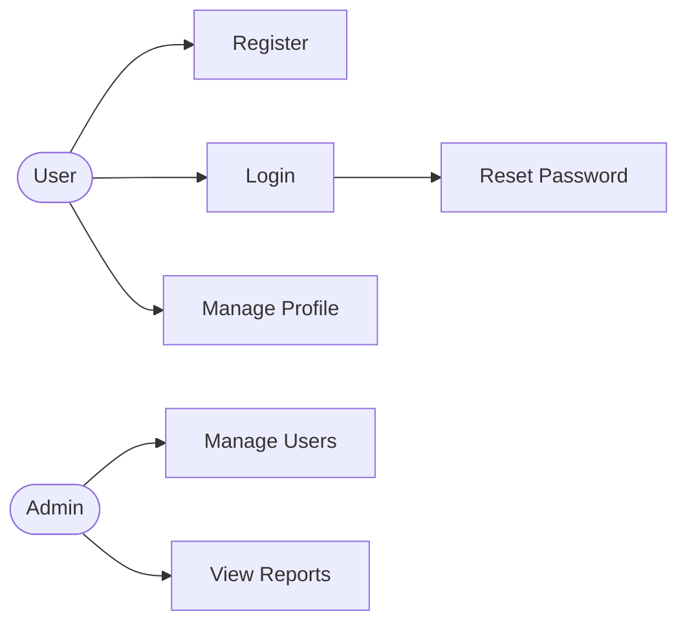
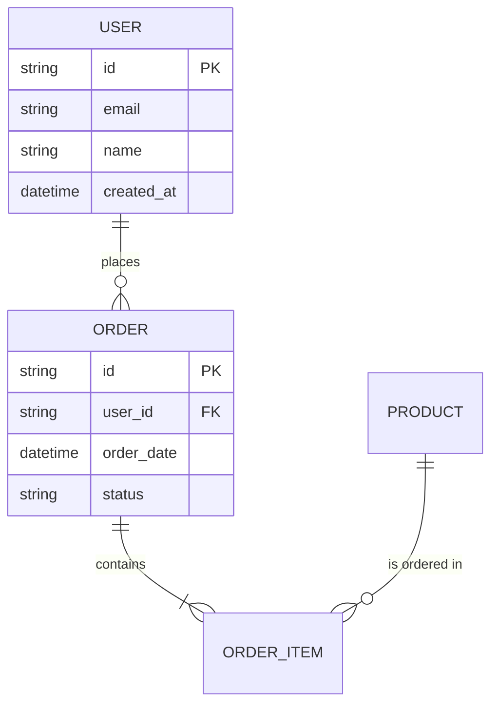

# SRS Document Builder

Generate structured Software Requirements Specification (SRS) documents based on the IEEE 830 standard, adapted to modern software development practices.

## Workflow

1. **Gather context** — Understand the project scope, stakeholders, and type of system
2. **Select document profile** — Choose the appropriate SRS depth based on the project
3. **Analyze and structure requirements** — Organize functional and non-functional requirements
4. **Generate the SRS document** — Produce the complete document in Markdown
5. **Generate traceability matrix** — Link requirements to use cases and acceptance criteria

## Step 1: Gather Context

Before writing anything, collect the essential information. If the user hasn't provided enough context, ask targeted questions — but don't overwhelm them with a long questionnaire. Focus on the gaps.

### Essential Information

| Information | Why It Matters | How to Get It |
|-------------|---------------|---------------|
| **Project name and purpose** | Frames the entire document | Ask the user or infer from codebase |
| **System type** | Determines relevant non-functional requirements | Web app, mobile, API, microservice, desktop, embedded |
| **Target users/stakeholders** | Drives use cases and user stories | Ask who will use the system |
| **Key features** | Core of the functional requirements | Ask or analyze existing code/docs |
| **Known constraints** | Technology, budget, timeline, regulatory | Ask the user |
| **Integrations** | External systems the software must interact with | Ask or analyze existing code |

If the user provides a codebase, analyze it to pre-fill as much as possible — read controllers, entities, and configuration to infer features, integrations, and technology constraints. Then confirm your findings with the user instead of asking from scratch.

If the user provides a general description or idea (no codebase), work with what they give you and ask only for what's missing.

## Step 2: Select Document Profile

Not every project needs a 50-page SRS. Match the depth to the project's actual needs:

| Profile | When to Use | Sections Included |
|---------|-------------|-------------------|
| **Lightweight** | MVPs, prototypes, small internal tools | Introduction, General Description, Core Functional Requirements, Key Non-Functional Requirements |
| **Standard** | Most production projects | All sections from the template below |
| **Formal** | Regulated industries, government contracts, large enterprise | All sections + appendices, glossary, formal change control, approval signatures |

Default to **Standard** unless the user indicates otherwise. If you detect the project is an MVP or prototype, suggest Lightweight. If the user mentions compliance, audits, or formal processes, suggest Formal.

## Step 3: Analyze and Structure Requirements

### Functional Requirements

Organize functional requirements by feature modules. Each requirement must have:

- **ID**: Unique identifier following the pattern `RF-<module>-<number>` (e.g., `RF-AUTH-001`)
- **Name**: Short descriptive title
- **Description**: What the system must do, written from the system's perspective
- **Priority**: High / Medium / Low (use MoSCoW if the user prefers: Must, Should, Could, Won't)
- **Acceptance criteria**: Concrete, testable conditions that confirm the requirement is met

**Writing good requirements** — each requirement should be:
- **Specific**: "The system shall allow users to reset their password via email" not "The system shall handle passwords"
- **Testable**: If you can't write a test for it, rewrite it
- **Independent**: One requirement, one behavior — avoid compound statements with "and"/"or"
- **Traceable**: Every requirement links to a use case or user story

**Example:**

| ID | Name | Description | Priority | Acceptance Criteria |
|----|------|-------------|----------|-------------------|
| RF-AUTH-001 | User Registration | The system shall allow new users to register by providing email, password, and full name. The password must meet complexity requirements (min 8 chars, 1 uppercase, 1 number, 1 special char). | High | 1. User fills registration form and receives confirmation email. 2. Duplicate email is rejected with descriptive error. 3. Weak password is rejected with specific guidance. |
| RF-AUTH-002 | User Login | The system shall authenticate users with email and password, issuing a JWT token valid for 24 hours. | High | 1. Valid credentials return JWT token. 2. Invalid credentials return 401 with generic error. 3. Account locked after 5 failed attempts. |

### Non-Functional Requirements

Organize by category. Only include categories relevant to the system — don't add performance requirements for an internal batch tool that runs once a week.

| Category | ID Pattern | Covers |
|----------|-----------|--------|
| **Performance** | RNF-PERF-xxx | Response times, throughput, concurrent users |
| **Security** | RNF-SEC-xxx | Authentication, authorization, data protection, OWASP compliance |
| **Availability** | RNF-AVAIL-xxx | Uptime SLAs, disaster recovery, failover |
| **Scalability** | RNF-SCAL-xxx | Horizontal/vertical scaling, load handling |
| **Usability** | RNF-USAB-xxx | Accessibility, UX standards, device support |
| **Maintainability** | RNF-MAINT-xxx | Code standards, documentation, deployment |
| **Compatibility** | RNF-COMP-xxx | Browsers, OS, devices, APIs |
| **Regulatory** | RNF-REG-xxx | GDPR, HIPAA, PCI-DSS, local regulations |

Each non-functional requirement needs measurable criteria. "The system shall be fast" is useless. "API responses shall return in under 200ms at p95 under 1000 concurrent users" is testable.

### Use Cases

For each major feature, write a use case:

```markdown
### UC-<number>: <Use Case Name>

- **Actor**: Who initiates this action
- **Preconditions**: What must be true before this use case starts
- **Postconditions**: What is true after successful completion
- **Main Flow**:
  1. Step-by-step normal execution
  2. Each step describes one actor-system interaction
  3. Use present tense and active voice
- **Alternative Flows**:
  - **<step>a**: Description of the alternative path
- **Exception Flows**:
  - **E1**: What happens when something goes wrong
```

Keep use cases at the right level of abstraction — they describe *what* happens, not *how* the system implements it internally.

## Step 4: Generate the SRS Document

### Document Template

Write the document to `docs/srs/SRS-<project-name>.md` (or the location the user specifies).

Use this structure for **Standard** profile. For Lightweight, include only the sections marked with **(L)**. For Formal, include everything plus the appendices section.

```markdown
# Software Requirements Specification (SRS)
## <Project Name>

| Field | Value |
|-------|-------|
| Version | 1.0 |
| Date | <current date> |
| Author | <author> |
| Status | Draft |

---

## Change History

| Version | Date | Author | Description |
|---------|------|--------|-------------|
| 1.0 | <date> | <author> | Initial version |

---

## Table of Contents
[Auto-generated based on included sections]

---

## 1. Introduction (L)

### 1.1 Purpose
[What this document covers and who it's for]

### 1.2 Scope
[System name, what it does and does NOT do, benefits, objectives]

### 1.3 Definitions, Acronyms, and Abbreviations
[Domain-specific terms the reader needs to understand this document]

### 1.4 References
[External documents, standards, APIs referenced]

### 1.5 Document Overview
[Brief description of how the rest of the document is organized]

---

## 2. General Description (L)

### 2.1 Product Perspective
[How this system fits into the larger ecosystem — is it standalone, part of
a suite, replacing something? Include a high-level context diagram if useful]

### 2.2 Product Features Summary
[Bullet list of major features — details come in Section 3]

### 2.3 User Classes and Characteristics
[Who uses the system, their technical level, frequency of use]

### 2.4 Operating Environment
[Hardware, OS, browsers, cloud platform, database, runtime requirements]

### 2.5 Design and Implementation Constraints
[Technology mandates, regulatory requirements, conventions to follow]

### 2.6 Assumptions and Dependencies
[What we're assuming to be true; external factors that could affect requirements]

---

## 3. Specific Requirements

### 3.1 Functional Requirements (L)

#### 3.1.1 <Feature Module 1>
[Requirements table for this module — see format in Step 3]

#### 3.1.2 <Feature Module 2>
[Requirements table]

### 3.2 Non-Functional Requirements (L)

#### 3.2.1 Performance
[Measurable performance requirements]

#### 3.2.2 Security
[Authentication, authorization, data protection requirements]

#### 3.2.3 Availability and Reliability
[Uptime, recovery, fault tolerance]

#### 3.2.4 Scalability
[Growth expectations and how the system should handle them]

#### 3.2.5 Usability
[Accessibility, UX requirements]

#### 3.2.6 Maintainability
[Code quality, deployment, monitoring requirements]

### 3.3 External Interface Requirements

#### 3.3.1 User Interfaces
[UI requirements, screen descriptions, key interaction patterns]

#### 3.3.2 Hardware Interfaces
[If applicable]

#### 3.3.3 Software Interfaces
[APIs, databases, external services the system integrates with]

#### 3.3.4 Communication Interfaces
[Protocols, data formats, messaging]

---

## 4. Use Cases

### 4.1 Use Case Diagram
[Mermaid or text-based overview of actors and use cases]

### 4.2 Use Case Specifications
[Detailed use cases — see format in Step 3]

---

## 5. Data Model

### 5.1 Entity Descriptions
[Key entities and their attributes]

### 5.2 Entity Relationship Diagram
[Mermaid ER diagram showing relationships]

---

## 6. Requirements Traceability Matrix

[Table mapping requirements → use cases → acceptance tests]

---

## 7. Appendices (Formal profile only)

### 7.1 Glossary
### 7.2 Analysis Models
### 7.3 Pending Decisions (TBD List)
```

### Writing Guidelines

- Write in third person and present tense: "The system shall..." not "We will..."
- Use "shall" for mandatory requirements, "should" for recommended, "may" for optional
- Avoid ambiguous language: "intuitive", "user-friendly", "fast", "robust" — replace with measurable criteria
- Number everything — requirements, use cases, sections — for traceability
- Keep paragraphs short and scannable; use tables and lists over prose when presenting requirements

## Step 5: Traceability Matrix

The traceability matrix connects the dots between requirements, use cases, and acceptance criteria. This is what makes an SRS actually useful for the development team.

```markdown
| Requirement ID | Requirement Name | Use Case | Acceptance Criteria | Status |
|---------------|-----------------|----------|-------------------|--------|
| RF-AUTH-001 | User Registration | UC-01 | AC-001, AC-002, AC-003 | Defined |
| RF-AUTH-002 | User Login | UC-02 | AC-004, AC-005, AC-006 | Defined |
| RNF-SEC-001 | Password Encryption | UC-01, UC-02 | AC-007 | Defined |
```

Status values: `Proposed` → `Defined` → `Approved` → `Implemented` → `Verified`

## Output Location

Write the SRS document to `docs/srs/SRS-<project-name>.md` by default. If the user specifies a different path, use that instead.

For Formal profile, also generate:
- `docs/srs/traceability-matrix-<project-name>.md` — Standalone traceability matrix
- `docs/srs/use-cases-<project-name>.md` — Detailed use case specifications (if the document is too long)

## Adapting to Project Type

The general structure stays the same, but emphasize different areas based on the project type:

| Project Type | Emphasize | De-emphasize |
|-------------|-----------|--------------|
| **Web Application** | UI requirements, browser compatibility, security (OWASP), responsive design | Hardware interfaces |
| **REST API / Microservice** | Software interfaces, data contracts, performance SLAs, error handling | User interfaces, usability |
| **Mobile App** | Usability, device compatibility, offline behavior, push notifications | Hardware interfaces (unless IoT) |
| **Enterprise / Legacy Integration** | External interfaces, data migration, backward compatibility | Scalability (usually fixed) |
| **Regulated (Healthcare, Finance)** | Regulatory compliance, audit trails, data retention, security | — |

## Mermaid Diagrams

Enrich the document with diagrams where they add clarity:

### Use Case Diagram


### Entity Relationship Diagram


### System Context Diagram
When it adds value, include a simplified context diagram showing external actors and systems. If the c4-architecture skill is available, reference it for more detailed architectural diagrams.

## References

- [references/ieee-830-checklist.md](references/ieee-830-checklist.md) — IEEE 830 compliance checklist and quality criteria for requirement validation
- [references/requirements-patterns.md](references/requirements-patterns.md) — Common requirement patterns for typical system features (auth, CRUD, notifications, payments, file handling)
